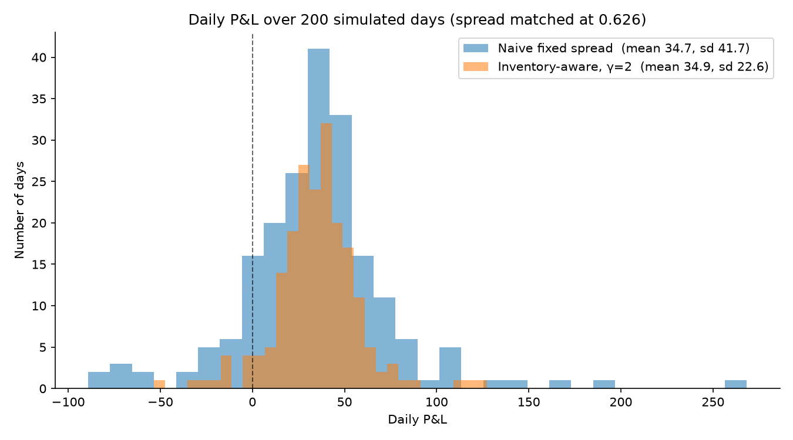

# Market Making Simulator

A simulated market and a market-making bot, built to test one question: does
adjusting your quotes based on the inventory you're holding actually reduce
risk, and by how much?

Implements a simplified version of the Avellaneda–Stoikov reservation-price
model in Python, with no dependencies beyond `matplotlib` for the plot.

## Finding

Compared against a naive fixed-spread strategy quoting the same spread
width and run on the same 200 simulated price paths inventory-aware
quoting cut daily P&L standard deviation by 46% (41.7 → 22.6) with no
loss of mean profit (34.7 → 34.9).

  

Trade counts were near-identical between the two strategies (117.8 vs 119.8
fills per day), which rules out the obvious alternative explanation — the
inventory-aware strategy isn't safer because it trades less. It trades the
same amount and ends up less exposed.

## How it works

A market maker earns money by quoting a bid below fair value and an ask above
it, capturing the spread when both sides fill. It isn't betting on direction.
The risk is*inventory: if you accumulate a large position and the price
moves against it, the spread you earned gets wiped out.

The Avellaneda–Stoikov approach handles this by shifting a *reservation price*
away from fair value in proportion to your current inventory, then quoting
around that shifted centre instead. Holding too much makes your ask more
attractive and your bid less attractive, pulling your position back toward
zero without predicting anything about where the price is going.

Three components:

- **`price_simulator.py`** — generates a random-walk "true" price and decides
  whether an incoming order fills, with probability decaying exponentially in
  the distance between the quote and fair value (`A·exp(-k·d)`).
- **`market_maker.py`** — the bot. Computes the reservation price and optimal
  spread, tracks inventory and cash.
- **`simulate.py`** — runs one day and returns its metrics.
- **`Experiment.py`** — the comparison across risk-aversion values.

## Method

Two things were necessary to make the comparison mean anything:

**Matched spread width.** The AS spread varies with the risk-aversion
parameter γ, so a single fixed naive baseline would have confounded
skew-vs-no-skew with wide-vs-narrow quoting. Each AS configuration is instead
compared against a naive baseline quoting that same computed width.

**Paired seeds.** Both strategies run on seeds 0–199, so each faces the same
price paths. With daily P&L noise around 40, unpaired runs would have
struggled to resolve the effect at all.

## Results

Each row pair shares a spread width. 200 simulated days per configuration.

| config | spread | mean | std | 5th pct | worst | max inv | trades |
|---|---|---|---|---|---|---|---|
| naive | 0.817 | 35.99 | 37.71 | −23.88 | −79.80 | 12.1 | 93.6 |
| AS γ=0.1 | 0.817 | 36.09 | 35.99 | −23.28 | −78.31 | 11.7 | 93.8 |
| naive | 0.762 | 35.51 | 38.50 | −20.55 | −94.57 | 12.6 | 100.3 |
| AS γ=0.5 | 0.762 | 36.12 | 31.69 | −13.18 | −55.25 | 11.2 | 100.5 |
| naive | 0.707 | 35.70 | 38.40 | −22.24 | −83.39 | 13.1 | 107.3 |
| AS γ=1 | 0.707 | 35.20 | 27.71 | −10.79 | −55.73 | 10.3 | 107.8 |
| naive | 0.626 | 34.67 | 41.72 | −21.94 | −89.18 | 13.6 | 117.8 |
| AS γ=2 | 0.626 | 34.87 | 22.60 | −0.57 | −53.42 | 9.3 | 119.8 |
| naive | 0.500 | 32.81 | 45.85 | −25.32 | −168.97 | 14.7 | 136.4 |
| AS γ=5 | 0.500 | 31.30 | 15.55 | +9.45 | −27.02 | 7.6 | 142.2 |
| naive | 0.428 | 30.97 | 49.10 | −31.32 | −136.85 | 15.0 | 148.5 |
| AS γ=10 | 0.428 | 26.57 | 11.40 | +9.33 | −15.71 | 6.4 | 162.0 |
| naive | 0.445 | 31.25 | 49.07 | −30.99 | −137.98 | 14.9 | 145.6 |
| AS γ=25 | 0.445 | 18.20 | 8.05 | +6.18 | −4.75 | 5.2 | 181.9 |

Variance reduction is roughly free up to γ≈2 and cheap up to γ≈5, where the
5th-percentile day turns profitable.past γ≈10 you keep buying variance reduction, but the price in mean profit rises steeply.

## Limitations

**Order flow is uninformed.** Incoming orders arrive at random, with no
relationship to where the price is about to go. Real markets have traders who
hit your quote *because* they know something you don't — adverse selection —
and that is the main reason naive market making loses money in practice. This
simulation cannot show that effect, so it overstates profitability.

**Simplified model.** The full Avellaneda–Stoikov result is derived through
stochastic optimal control. This implements the reservation-price and spread
formulas directly and uses a constant volatility supplied by the simulation
rather than one estimated from observed prices.

**Synthetic prices.** A symmetric random walk has no drift, no volatility
clustering, and no jumps. Real price series have all three.

## Running it

```bash
python simulate.py       # one day
python Experiment.py     # the full comparison table
python plot_results.py   # regenerate the histogram
```

## Sources

- Avellaneda & Stoikov (2008), *High-frequency trading in a limit order book*
- [Hummingbot's guide to the Avellaneda–Stoikov strategy](https://hummingbot.org/blog/guide-to-the-avellaneda--stoikov-strategy/)

The model came from these; the implementation is my own.
